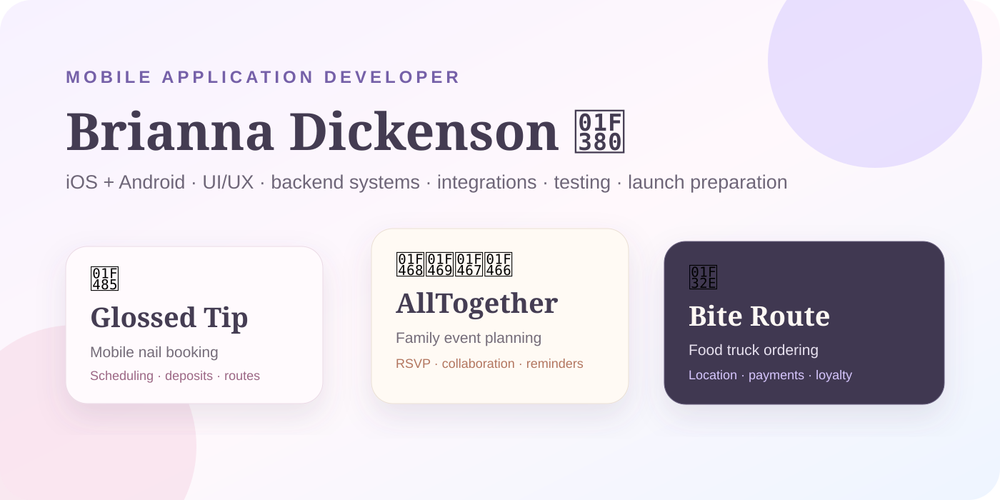
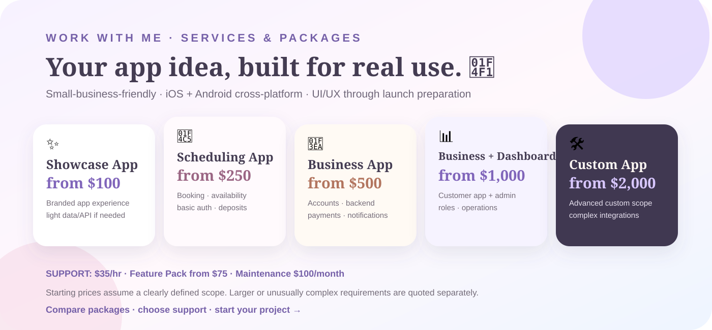
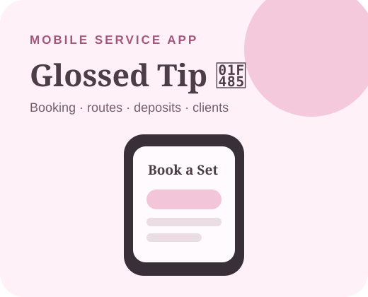
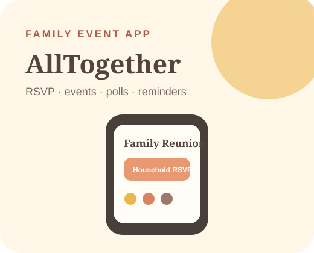
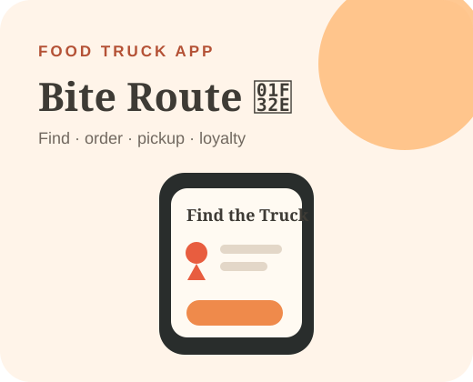

# 🎀 Brianna Dickenson 🎀

## **Mobile Application Developer | iOS · Android · Cross-Platform Apps**

I design and build complete mobile applications for **small businesses, entrepreneurs, and custom product ideas**—from product strategy and UI/UX through development, backend systems, integrations, testing, and launch preparation.

---

## 💌 Work With Me

💻 **Seeking Full Time Remote Position**  

💌 **Available For Freelance** 

📱 **[View Live Portfolio](https://breyhanaariel.github.io/mobile-app-developer/)**

I take on mobile app projects for independent professionals, entrepreneurs, and small businesses, including MVPs, scheduling apps, business apps, app redesigns, new features, bug fixes, backend/API integrations, payments/authentication, and owner/staff dashboards.

🌷 **[View Services, Packages & Project Inquiry →](https://breyhanaariel.github.io/mobile-app-developer/services.html)**  
💌 **[Send a Project Inquiry →](https://breyhanaariel.github.io/mobile-app-developer/services.html#inquiry)**  
Prefer email? [breyhanadickenson@gmail.com](mailto:breyhanadickenson@gmail.com?subject=Mobile%20App%20Project%20Inquiry)

---

## 🧠 Core Stack

**Mobile:** Kotlin · Jetpack Compose · Flutter · Riverpod · React Native · Expo · iOS + Android cross-platform development  
**Backend:** TypeScript · Fastify · REST APIs · server-side business logic  
**Data:** PostgreSQL · Neon · Firebase · Firestore · Drizzle ORM  
**Integrations:** Stripe · authentication · Google Maps/Routes · Cloudinary · push notifications · email reminders  
**Product:** UI/UX · responsive admin tooling · accessibility-minded interfaces · business workflows  
**Delivery:** Git · GitHub · GitHub Actions · automated testing · Android releases · iOS-ready project generation · launch preparation

---

## 🌷 Featured Work

*The showcase work is made up of independent concept projects based on realistic client briefs. No paid client relationship or fictional business results are claimed.*

<table>
<tr>
<td width="280" valign="top">  <a href="./glossed-tip/README.md">📖 Case Study</a></td>
<td valign="top">
<h3>💅 Glossed Tip — Mobile Nail Booking &amp; Business Management</h3>

Mobile Service Business | Booking, route-aware scheduling, deposits, client management

A mobile nail technician concept designed to replace booking through DMs and disconnected scheduling/payment tools. Customers can browse nail sets, configure services, enter a service address, view travel-feasible availability, upload inspiration, calculate a deposit, and rebook previous services. A responsive technician dashboard supports day-to-day business operations.

<strong>Demonstrates:</strong> native Android development · booking logic · route-aware scheduling · service pricing · deposits · media selection · customer/business workflows

<strong>Build:</strong> Kotlin · Jetpack Compose · Firebase integration architecture · Google Places/Routes architecture · Stripe architecture · automated tests · GitHub Actions

<strong>Business goal:</strong> Make a mobile service business easier to book and operate without relying on manual scheduling across multiple disconnected tools.

<strong>Status:</strong> Demo Complete · production cloud/provider integration pending

<em>Independent concept project — no real client relationship or business results are claimed.</em>

</td>
</tr>
</table>

<table>
<tr>
<td width="280" valign="top">  <a href="./all-together/README.md">📖 Case Study</a> · <a href="https://github.com/breyhanaariel/mobile-app-developer/releases/tag/all-together-v002">📱 Android Release</a></td>
<td valign="top">
<h3>👨‍👩‍👧‍👦 AllTogether — Family Event Planning Platform</h3>

Consumer App | Private events, Household RSVP, collaboration, reminders

A family-event platform designed to bring reunions, birthdays, vacations, holidays, schedules, polls, tasks, shared expenses, photos, and event conversation into one private experience instead of scattered group texts and spreadsheets.

<strong>Signature feature:</strong> Household RSVP — one adult can manage attendance for an entire household, including children and guests who do not need accounts.

<strong>Demonstrates:</strong> cross-platform mobile development · relational data · multi-user collaboration · role-based authorization · invitations · accessibility · notifications · media moderation

<strong>Build:</strong> React Native · Expo · TypeScript · Fastify · Neon PostgreSQL · Drizzle · Clerk architecture · Cloudinary · Expo Push · Resend · Google Maps · CI/testing

<strong>Business goal:</strong> Reduce the coordination friction of multi-generational family events by putting the information and decisions everyone needs in one place.

<strong>Status:</strong> Code Complete · Live Neon Persistence · external provider setup pending

<em>Independent concept project — no real client relationship or business results are claimed.</em>

</td>
</tr>
</table>

<table>
<tr>
<td width="280" valign="top">  <a href="./bite-route/README.md">📖 Case Study</a> · <a href="https://github.com/breyhanaariel/mobile-app-developer/releases/tag/bite-route-v001">📱 Android Release</a></td>
<td valign="top">
<h3>🌮 Bite Route — Food Truck Ordering, Location &amp; Loyalty</h3>

Mobile Commerce | Location, ordering, payments, pickup tracking, loyalty

A food-truck app designed to help customers immediately find the truck, see current menu availability, customize and order food, choose pickup timing, track order status, and return through a loyalty program. A responsive Owner/Staff dashboard supports orders and business operations.

<strong>Signature feature:</strong> Find the Truck — current/next location, ordering state, pickup estimate, optional distance, and upcoming route are surfaced immediately.

<strong>Demonstrates:</strong> Flutter · mobile commerce · maps/location · modifier pricing · guest/account checkout · payment-state handling · capacity-aware pickup · loyalty · role-based operations

<strong>Build:</strong> Flutter · Riverpod · Fastify · TypeScript · Neon PostgreSQL · Drizzle · Firebase · Stripe sandbox · FCM · Cloudinary · Google Maps · Next.js · Tailwind CSS · CI/testing

<strong>Business goal:</strong> Give a mobile food business one branded customer experience for discovery, ordering, pickup, and repeat business while giving staff practical operational controls.

<strong>Status:</strong> Code Complete · Live Neon Persistence · external provider setup pending

<em>Independent concept project — no real client relationship or business results are claimed.</em>

</td>
</tr>
</table>

---

## 📱 Mobile App Development Quality

| Project | Product Evidence | Backend / Integration Evidence | Production Evidence |
| --- | --- | --- | --- |
| [Glossed Tip](./glossed-tip/README.md) | Booking · portfolio · service customization · client management | Firebase architecture · Stripe architecture · Google routing architecture | Kotlin tests · Android APK · GitHub Actions |
| [AllTogether](./all-together/README.md) | Events · Household RSVP · polls · tasks · expenses · chat · photos | Live Neon · Fastify/Drizzle · Clerk/Cloudinary/notification integrations in code | Automated tests · iOS project validation · Android release · CI |
| [Bite Route](./bite-route/README.md) | Ordering · maps · pickup tracking · loyalty · owner/staff operations | Live Neon · Stripe/Firebase/Cloudinary integrations in code · Fastify/Drizzle API | Flutter/API tests · admin build · iOS/Android generation · Android release · CI |

---

## ✅ Production Quality

These projects are built as working application codebases rather than interface-only mockups. Across the portfolio I demonstrate application state and business rules, backend/API architecture, database design, authentication patterns, third-party integrations, automated tests, CI, Android packaging, and iOS-ready source where appropriate.

External credentials, provider accounts, production signing keys, and store approvals remain outside public GitHub repositories. I distinguish between code-complete functionality, demo integrations, and live provider configuration rather than presenting unconfigured services as production deployments.

---

## 🌈 How I Work

1. **Understand** — define the app idea, users, business goal, platforms, constraints, budget, and essential features.
2. **Plan** — turn the idea into a realistic MVP or project scope, user flows, data requirements, integrations, and milestones.
3. **Design** — create clear UI/UX, visual direction, navigation, states, and reusable interface patterns.
4. **Build** — develop the mobile experience, backend/database behavior, business rules, and required admin tooling.
5. **Integrate** — connect authentication, payments, maps, media, notifications, APIs, and other services appropriate to the product.
6. **Test & Launch** — validate critical flows, fix defects, prepare builds, document handoff, and support App Store / Play Store launch preparation without guaranteeing store approval.

---

## 🌸 Explore My Work

My portfolio is intentionally separated by specialty so each discipline can tell a focused story while still showing how my design and development skills connect.

- 🎀 [UI/UX Designer](https://github.com/breyhanaariel/ui-ux-designer) — product design, research, flows, design systems, prototyping, and developer handoff
- 💻 [Front-End Developer](https://github.com/breyhanaariel/front-end-developer) — React, Next.js, TypeScript, APIs, state management, testing, accessibility, and measured performance
- 🌐 [Web Designer](https://github.com/breyhanaariel/web-designer) — responsive websites, redesigns, e-commerce, SEO/accessibility fundamentals, and business-focused client work
- 🎨 [Graphic Designer](https://github.com/breyhanaariel/graphic-designer) — brand identity, campaign design, marketing assets, print, illustration, presentations, and motion
- 📱 **Mobile Application Developer** — iOS + Android apps, UI/UX, backend systems, integrations, testing, and launch preparation
- 🤖 [AI Automation Specialist](https://github.com/breyhanaariel/ai-automation-specialist) — AI-powered workflows, agents, APIs, integrations, automation, and human-in-the-loop systems
